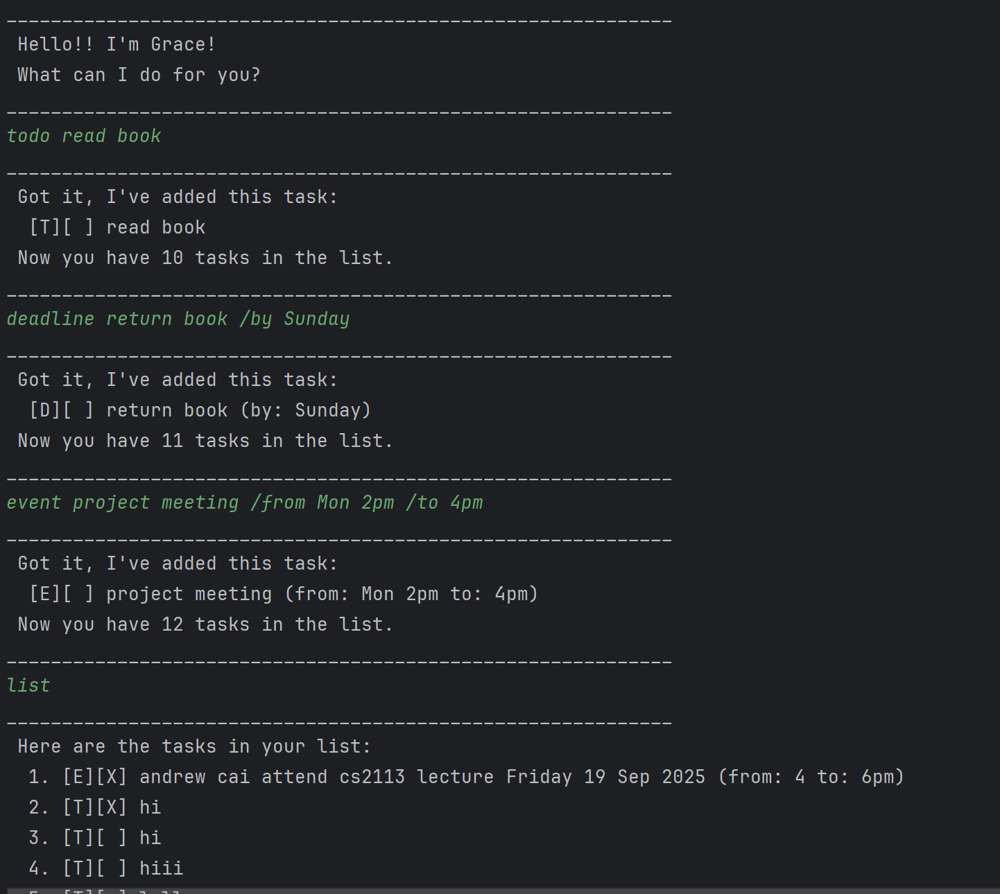

# Grace User Guide

Grace is a simple task management chatbot that helps you keep track of your todos, deadlines, and events. 
You can interact with it using text commands, and it will save your tasks to your computer so that they are available the next time you use your program.

## Getting Started
1. Download the `grace.jar` file and place it in an empty folder.
2. Open a terminal/command prompt in that folder.
3. Run the application with: java -jar grace.jar
4. Grace will greet you and wait for your commands.

## Features
### Adding a Todo  
Adds a simple task with only a description.

**Usage:**  
todo DESCRIPTION  

**Example:**  
todo read book  

**Expected Output:**  
Got it, I've added this task:  
[T][ ] read book  
Now you have 1 task in the list.  

### Adding a Deadline  

Adds a task with a description and a deadline.

**Usage:**  
deadline DESCRIPTION /by DATE  

**Example:**  
deadline return book /by Sunday  

**Expected Output:**  
Got it, I've added this task:  
[D][ ] return book (by: Sunday)  
Now you have 2 tasks in the list.  

### Adding an Event

Adds a task with a description, start time, and end time.

**Usage:**  
event DESCRIPTION /from START /to END  

**Example:**  
event project meeting /from Mon 2pm /to 4pm  

**Expected Output:**  
Got it, I've added this task:  
[E][ ] project meeting (from: Mon 2pm to: 4pm)  
Now you have 3 tasks in the list.  

### Listing Tasks

Displays all tasks currently in your list.

**Usage:**  
list

**Expected Output:**  
Here are the tasks in your list:
1. [T][ ] read book  
2. [D][ ] return book (by: Sunday)
3. [E][ ] project meeting (from: Mon 2pm to: 4pm)

### Marking a Task

Marks a task as done.

**Usage:**  
mark INDEX

**Example:**  
mark 1  

**Expected Output:**  
Nice! I've marked this task as done:  
[T][X] read book  

### Unmarking a Task

Marks a task as not done.

**Usage:**  
unmark INDEX  

**Example:**  
unmark 1  

**Expected Output:**  
Okay, I've marked this task as not done yet:  
[T][ ] read book

### Deleting a Task

Removes a task from the list.

**Usage:**  
delete INDEX  

**Example:**  
delete 2  

**Expected Output:**  
Noted, I've removed this task:  
[D][ ] return book (by: Sunday)  
Now you have 2 tasks in the list.

### Finding Tasks

Finds tasks containing a given keyword.

**Usage:**  
find KEYWORD  

**Example:**  
find book  

**Expected Output:**  
Here are the matching tasks in your list:  
1. [T][ ] read book

### Exiting Grace

Closes the application.

**Usage:**  
bye  

**Expected Output:**  
Bye. Hope to see you again soon.